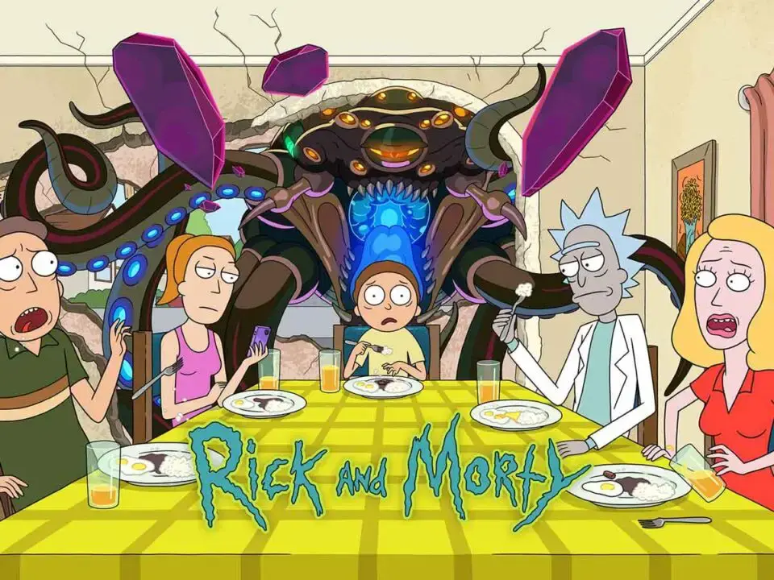

# *The Rick and Morty API*

  

Este proyecto fue creado con [Create React App](https://github.com/facebook/create-react-app). Utiliza la API pública [The Rick and Morty API](https://rickandmortyapi.com/)

La aplicación al iniciar, muestra una página con una imágen ilustrativa, y un boton para acceder al listado de personajes. En la página de listado de personajes se muestra la siguiente información: imagen, nombre, estado el personaje (alive con un punto verde, dead con un punto rojo), cantidad de episodios en los que aparece y especie del personaje. Posee además un link para volver a la página inicial.

## **Probar la aplicación en modo desarrollo**

Puedes descargar una copia del repositorio -> [Repositorio](https://github.com/Ernest2104/rick-morty)

__IMPORTANTE:__ Es necesario contar minimamente con la última versión estable de Node y NPM. Asegurarse de contar con ella para poder instalar correctamente las dependecias necesarias para correr la aplicación.

En este caso la api no necesita key.

### `npm install` 

para instalar las dependencias, y luego:

### `npm run dev`

Abre [http://localhost:3000](http://localhost:3000) para ver la aplicación en tu navegador.

## **Probar la aplicación en producción**

Abre https://adorable-pothos-196d5c.netlify.app/ para ver la aplicación deployada en tu navegador.